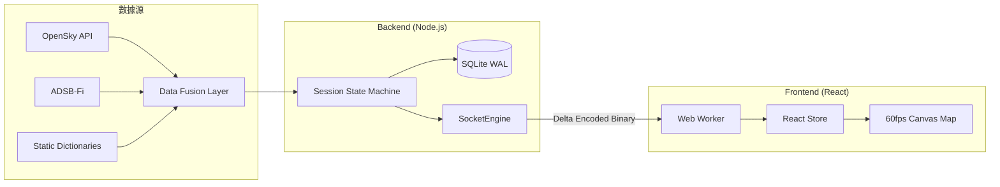

# ✈️ AEROSTRAT

> **高效能全球航空監控與實時雷達系統**

[](https://reactjs.org/)
[](https://nodejs.org/)
[](https://www.sqlite.org/)
[](https://opensource.org/licenses/MIT)

AEROSTRAT 是一款專為航空愛好者與開發者設計的全球實時監控平台。系統整合了 OpenSky 與 ADSB-Fi 等多源遙測數據，透過二進制 WebSocket 協議與 60fps Canvas 渲染技術，在極低的資源佔用下提供軍事級的流暢雷達體驗。

---

## 📖 目錄

- [✨ 核心亮點](#-核心亮點)
- [📸 介面預覽](#-介面預覽)
- [🛠 技術架構](#-技術架構)
- [🚀 快速開始](#-快速開始)
- [🏗 系統設計細節](#-系統設計細節)
- [📊 監控與測試](#-監控與測試)
- [📜 授權協議](#-授權協議)

---

## 📸 介面預覽


*圖：AEROSTRAT 專業雷達監控介面（模擬效果）*

---

## ✨ 核心亮點

### 📡 實時雷達與追蹤
- **60fps 平滑移動**：採用 Canvas 渲染引擎與高效能座標插值運算，告別地圖圖標閃爍。
- **航位推算 (Dead Reckoning)**：即使在網路延遲或資料更新間隙，航機也能依據慣性平滑移動。
- **高度色彩系統**：動態熱點染色，即時區分航機的爬升、巡航與下降狀態。

### 🔍 智能過濾與搜尋
- **多維度篩選**：可依據高度、地面速度、機型代碼（ICAO Type）進行精準過濾。
- **全域全文檢索**：快速定位航班編號 (Callsign)、註冊號或 ICAO 24-bit 地址。

### ⏲️ 時光機與回放
- **24小時歷史回溯**：完整記錄所有飛行路點，支持透過時間軸進行秒級精度回放。

### 📱 行動端深度優化
- **響應式介面**：針對手機與平板設計的抽屜式抽卡（Bottom Sheets）交互，單手即可操作。

---

## 🛠 技術架構

AEROSTRAT 採用 **前後端分離** 的高性能架構設計：



### 技術棧 (Tech Stack)
- **Frontend**: React 19, Vite 6, Leaflet 1.9, Tailwind CSS.
- **Backend**: Node.js 24, Express 5, Socket.io, MessagePack.
- **Persistence**: SQLite (better-sqlite3) with WAL mode enabled.
- **Utilities**: Playwright (E2E Testing), PM2 (Process Mgmt).

---

## 🚀 快速開始

### 1. 安裝環境
確保您的開發環境已安裝 **Node.js 18+**。

```bash
# 克隆專案
git clone https://github.com/liaw-boy/project_flightradar.git
cd project_aerostrat

# 安裝所有依賴
npm install
```

### 2. 環境變數配置
在 `backend/` 下建立 `.env`：
```env
PORT=3000
MONGODB_USE_LOCAL=false
# 填入您的 OpenSky 帳號金鑰（可選）
```

### 3. 初始化資料與運行
```bash
# 第一步：同步機場與航路基礎數據
cd backend && node scripts/syncOsintData.js

# 第二步：啟動開發模式
cd ..
npm run dev
```
啟動後訪問 `http://localhost:3005`。

---

## 🏗 系統設計細節

<details>
<summary><b>📦 二進制增量編碼 (Double Buffering & Delta Encoding)</b></summary>
為了極大化節省頻寬，WebSocket 僅推送狀態發生變化的「增量數據」。我們使用 MessagePack 進行二進制封裝，相較於傳統 JSON 格式，流量佔用減少了 70% 以上。
</details>

<details>
<summary><b>🚀 零垃圾回收壓力渲染 (Zero-GC Rendering)</b></summary>
前端 `FlightDataStore` 使用 TypedArrays (Float32Array) 作為環形緩衝區。MapView 元件會快取 Path2D 物件，避免在每秒 60 次的重繪中產生大量內存垃圾 (Garbage Collection)，確保長時間運行的穩定性。
</details>

<details>
<summary><b>🧬 多維元數據解析 (4-Layer Metadata Resolution)</b></summary>
每一架飛機的詳細資訊（機型、航空公司、起迄點）依序透過：記憶體索引 → 本地 SQLite → 特定 Fallback API → 官方資料庫進行非同步融合，保證資料的高準確率。
</details>

---

## 📊 監控與測試

- **健康檢查**: `http://localhost:3000/api/health`
- **系統統計**: `http://localhost:3000/api/stats`
- **自動化測試**: 
  ```bash
  cd client && npx playwright test
  ```

---

## 📜 授權協議

本項目基於 **MIT License** 授權。您可以自由使用、修改及分發。

---
> 如果您喜歡這個專案，請給我們一個 ⭐️ 支持！
