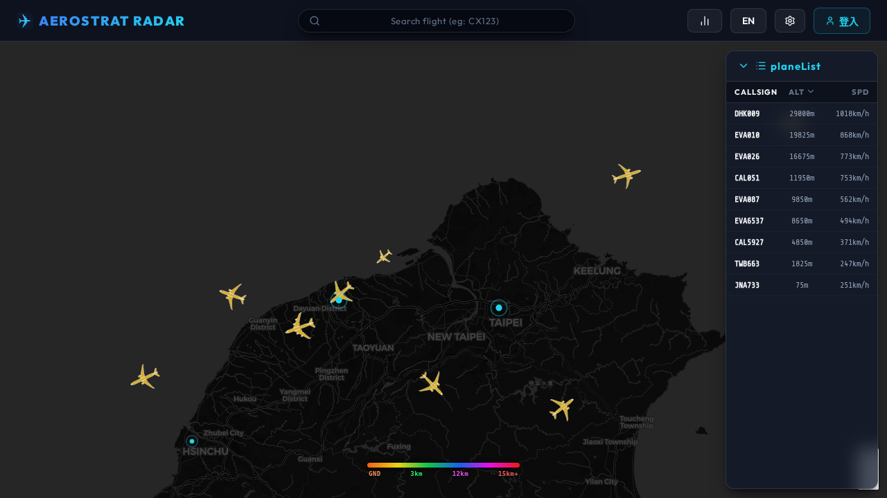
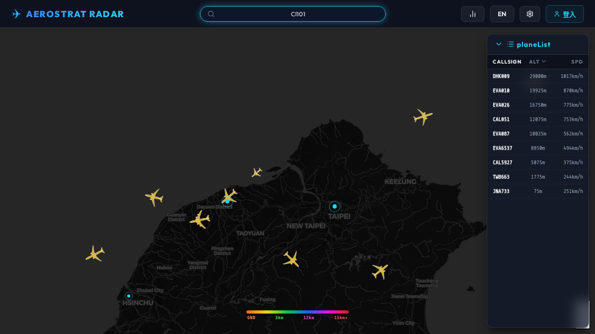

# AEROSTRAT

> **高效能全球航空監控與實時雷達系統**

[](https://reactjs.org/)
[](https://nodejs.org/)
[](https://www.sqlite.org/)
[](https://leafletjs.com/)
[](https://playwright.dev/)
[](https://github.com/liaw-boy/project_flightradar)

AEROSTRAT 是一款專為航空愛好者設計的全球實時監控平台。系統整合 OpenSky、ADSB-Fi 等多源資料，透過二進制 WebSocket 協議與 60fps Canvas 渲染技術，提供流暢專業的雷達體驗。

**線上展示 →** https://flyradar.spkuan.cc

---

## 目錄

- [介面預覽](#介面預覽)
- [主要功能](#主要功能)
- [技術架構](#技術架構)
- [目錄結構](#目錄結構)
- [快速開始](#快速開始)
- [環境變數](#環境變數)
- [部署](#部署)
- [測試](#測試)

---

## 介面預覽

### 主畫面 — 全球雷達地圖


*全球 ADS-B 即時飛機分佈，金色點陣為各架飛機，點擊後顯示側邊欄詳情*

### 即時飛機顯示



*Canvas 渲染引擎，60fps 平滑移動；金色圖示，選中後顯示亮金高亮*

### 搜尋功能



*全文搜尋：輸入呼號 (CI101)、ICAO24 地址或機型代碼，即時定位；輸入時右側顯示清除按鈕*

### 頂部導航列


*點擊 AEROSTRAT logo 回到地圖預設中心 · 即時航班計數*

---

## 主要功能

### 即時雷達追蹤
- **60fps 平滑動畫** — Canvas 引擎 + 航位推算 (Dead Reckoning)，資料更新間隙不閃爍
- **金色圖示系統** — 普通飛機金色 (`#D4AF37`)，選中飛機亮金 (`#FFD700`)
- **3-Tier 渲染管線** — SVG 精確圖形 > Path2D 嵌入輪廓 > 戰術點陣，自動降級
- **航跡追蹤** — 顯示歷史軌跡路徑，支援 24 小時歷史回放
- **高度色彩圖例** — ALTITUDE / TACTICAL / MONO 三種配色方案，底部顯示 ALT 色帶標籤

### 資料融合
- **多源整合** — airplanes.live、ADSB-Fi、OpenSky 三重冗餘，自適應切換（Adaptive Primary Telemetry Resolver）
- **機型資料庫** — Mictronics 全球 21 萬架航機資料，本地離線查詢
- **航線解析** — VRS 靜態路線庫 + ADSB.fi 即時路線 + AeroDataBox 時刻表
- **機場資料庫** — 全球機場 ICAO/IATA 代碼 + 座標快查（空間格狀索引，O(k)查詢）
- **METAR 天氣** — 自動從 NOAA 抓取目的地機場即時氣象（風向、風速、溫度、原始 METAR 電文）

### 飛行異常偵測
- **即時告警引擎** — 後端持續分析全球飛機狀態，偵測低速失速、急速下墜、超低空巡航等危險模式
- **SSE 廣播** — 異常事件透過 `/api/events` Server-Sent Events 推播至所有前端
- **通知容器** — `NotificationContainer` 以 toast 形式顯示，含機型、呼號、異常類型

### 過濾與搜尋
- **多維度篩選** — 高度、地速、機型代碼、軍事/商業分類
- **全文搜尋** — 呼號、ICAO24、機型、航空公司，支援快速清除（✕ 按鈕）
- **Logo 回中心** — 點擊頂部 AEROSTRAT logo 即可飛回預設視角 (25.17°N, 121.44°E)

### 資料連線狀態
- WebSocket 斷線超過 8 秒顯示 `LIVE LOST`；後台資料過期顯示 `DATA STALE`

### 行動裝置支援
- **MobileSheet** — 底部滑出式面板，顯示飛機詳情與互動操作
- **MobilePlaneCard** — 針對小螢幕最佳化的飛機資訊卡片
- **響應式佈局** — 桌面側邊欄 / 手機底部 sheet 自動切換

### 系統監控
- **監控頁面** — 即時顯示 DB 列數、記憶體用量、API quota、各資料來源健康狀態（`/monitor`，密碼保護，見 [docs/deploy.md](docs/deploy.md)）
- **效能監控** — `PerformanceMonitor` 元件顯示即時 FPS 與 JS heap 使用量

### 多國語言
- **中英雙語** — 所有 UI 文字支援繁體中文 / English 即時切換（含統計標籤、搜尋提示）

---

## 技術架構

### Frontend
| 技術 | 版本 | 用途 |
|------|------|------|
| React | 19 | UI 框架 |
| Vite | 6 | 構建工具 |
| Leaflet | 1.9 | 地圖底圖 |
| Canvas API | — | 飛機渲染（60fps） |
| @msgpack/msgpack | 3 | WebSocket 二進制協議（飛機資料） |
| Lucide React | — | 圖示系統 |
| flag-icons | 7 | 國旗圖示 |
| Playwright | — | E2E 測試 |

### Backend
| 技術 | 版本 | 用途 |
|------|------|------|
| Node.js | 24 | 執行環境 |
| Express | 5.2 | HTTP 伺服器 |
| better-sqlite3 | 12 | 本地資料庫（航跡點、航班 session） |
| ws | 8 | WebSocket 伺服器（飛機即時推播） |
| SSE | — | 異常事件推播（`/api/events`） |
| helmet | 8 | 安全 HTTP headers |
| compression | — | Gzip 壓縮 |
| express-rate-limit | 8 | API 速率限制 |
| node-cron | 4 | 定時任務（METAR、DB 清理） |
| msgpack-lite | — | 二進制序列化（伺服器端） |
| systemd | — | 程序管理（`aerostrat.service`，見 [docs/deploy.md](docs/deploy.md)） |

### 資料傳輸協議
| 通道 | 協議 | 資料 |
|------|------|------|
| 飛機即時位置 | WebSocket + MsgPack | 全機場景，每 5s 更新 |
| 飛行異常告警 | SSE (`/api/events`) | 危險飛行狀態廣播 |
| 航班詳情 API | HTTP REST | 按需查詢 |

---

## 目錄結構

```
project_aerostrat/
├── backend/
│   ├── server.js            # 主伺服器入口（app 初始化 + route 掛載）
│   ├── middleware/          # CORS/helmet/rate-limit、monitor session 驗證
│   ├── routes/              # 靜態資源、health/stats 路由
│   ├── services/            # 三層輪詢引擎、circuit breaker、狀態合併、METAR 同步等
│   ├── state/                # 融合引擎共用狀態（appState.js）
│   ├── views/                # /monitor 儀表板 HTML
│   ├── utils/                # ICAO24/typecode/geo 等純函式
│   ├── socketEngine.js      # WebSocket 引擎（飛機推播）
│   ├── crawler.js           # 多源 ADS-B 資料抓取
│   ├── accountPool.js       # OpenSky 帳號池管理
│   ├── controllers/         # flightController
│   ├── db/                  # SQLite 存取層（trackStore、metarStore 等）
│   ├── workers/             # 背景任務
│   ├── data/                # 機型、機場、航線等靜態資料
│   └── __tests__/           # 單元測試 + API 整合測試
├── client/
│   ├── src/
│   │   ├── components/      # React 元件（MapView、Sidebar、TopBar、MobileSheet 等）
│   │   ├── hooks/           # useI18n、useAnomalyStream、useFlightData 等
│   │   ├── utils/           # 飛機圖示、渲染工具
│   │   ├── services/        # DataManager、IndexedDB 快取
│   │   └── workers/         # flightWorker.js
│   └── tests/e2e/           # Playwright 測試
├── public-react/            # Build 輸出（由 backend 靜態服務）
├── docs/images/             # README 截圖
├── docker-compose.yml
└── deploy.sh                # 快速部署腳本
```

---

## 快速開始

### 環境需求
- Node.js 20+
- systemd（生產環境用 `aerostrat.service` 管理程序，見 [docs/deploy.md](docs/deploy.md)）

### 1. 複製並安裝

```bash
git clone https://github.com/liaw-boy/project_flightradar.git
cd project_flightradar

# 後端依賴
cd backend && npm install

# 前端依賴
cd ../client && npm install
```

### 2. 設定環境變數

```bash
cd backend
cp .env.example .env   # 依需求填寫（見下方說明）
```

### 3. 啟動開發環境

```bash
# 終端 1 — 後端
cd backend && node server.js

# 終端 2 — 前端 (Vite dev server)
cd client && npm run dev
# 前端 → http://localhost:3005
# 後端 → http://localhost:3000
```

### 4. Build 並啟動正式站

```bash
cd client && npm run build
cd ..
systemctl --user restart aerostrat.service
# 訪問 http://localhost:3000
```

> 詳細重啟/部署流程、為何不能手動 `kill` + `node server.js &`，見 [docs/deploy.md](docs/deploy.md)。

---

## macOS 桌面版

不想架伺服器、不想碰終端機？到 [Releases](../../releases) 頁面下載 `.dmg` 就能用，前端、後端、SQLite 全部打包在一個 App 裡，開起來直接可以用,不需要另外裝 Node.js。

- **Apple Silicon(M1/M2/M3/M4)** → 下載 `AeroStrat-<version>-arm64.dmg`
- **Intel Mac** → 下載 `AeroStrat-<version>-x64.dmg`

第一次開啟時,因為這是 unsigned build(沒有付費 Apple 開發者憑證做簽章/公證),macOS Gatekeeper 會擋下並顯示「AeroStrat 已損毀,無法打開」或類似訊息。這不是真的損毀,擇一操作即可:

1. **右鍵(或按住 Control 點擊)App → 打開**,在跳出的對話框裡再按一次「打開」(僅第一次需要)。
2. 或在終端機執行:
   ```bash
   xattr -cr /Applications/AeroStrat.app
   ```

App 資料(SQLite 資料庫、快取)會存放在 `~/Library/Application Support/AeroStrat/`,跟系統上其他 App 一樣,解除安裝時可以一併清掉。第一次啟動會花幾秒鐘準備本機資料,屬正常現象。

想自己從原始碼打包,參考根目錄的 `electron/`、`electron-builder.yml`、`.github/workflows/release-macos.yml`;本機開發模式(帶 HMR)用 `npm run dev:electron`。

---

## 環境變數

`backend/.env` 設定：

```env
# 監控頁面密碼（/monitor 路徑，session-based）
MONITOR_PASSWORD=<自設密碼>

# OpenSky 帳號池（選填，最多 5 組；額度用盡時自動輪替）
OPENSKY_USER1=
OPENSKY_PASS1=
OPENSKY_USER2=
OPENSKY_PASS2=

# API Keys（選填，增加資料來源）
AERODATABOX_API_KEY=
AIRLABS_API_KEY=

# TDX（選填，台灣本地航班補充資料）
TDX_CLIENT_ID=
TDX_CLIENT_SECRET=

# CORS（逗號分隔）
ALLOWED_ORIGINS=http://localhost:3000,http://localhost:3005

# 其他
PORT=3000
LOG_LEVEL=INFO
NODE_ENV=production
```

> 目前沒有登入/使用者系統，`.env` 沒有必填項——全部留空伺服器一樣能啟動，只是資料來源會減少。

---

## 部署

詳細流程（含正式站絕對不能手動 `kill`+`node server.js &` 的原因）見 [docs/deploy.md](docs/deploy.md)。

### 使用 deploy.sh（推薦）

```bash
# 自動：git pull → npm build → systemctl --user restart aerostrat.service
./deploy.sh
```

### 使用 Docker Compose

```bash
docker-compose up -d
```

### 手動部署流程

```bash
# 1. 拉取最新程式碼
git pull origin main

# 2. 建置前端
cd client && npm install && npm run build

# 3. 重啟後端
systemctl --user restart aerostrat.service
```

---

## 測試

### 執行 UX 流程測試（本地）

```bash
cd client
npx playwright test tests/e2e/ux_flow.spec.js
```

測試涵蓋：
1. 首頁無致命 JS 錯誤
2. 地圖渲染 + 飛機出現（15s 內）
3. 搜尋欄可輸入
4. 頂部導航列渲染
5. API Ping 健康檢查
6. 即時飛機資料 API 回應

### 執行生產煙霧測試

```bash
npx playwright test tests/e2e/prod_smoke.spec.js
```

### 執行完整 E2E 套件

```bash
npx playwright test tests/e2e/
```

---

> 如果您喜歡這個專案，歡迎給一個 Star ⭐
